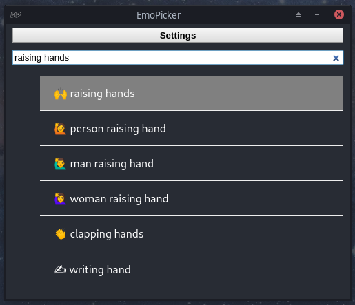
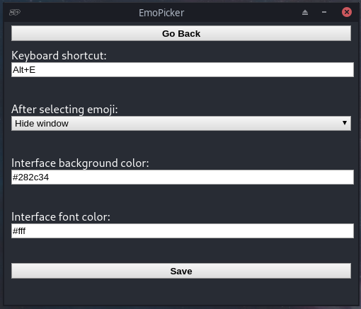

    

<h2 align='center'>EmoPicker</h2>

    
    

<h3 align='center'>Cross-platform desktop emojis picker</h3>

 

    
    

 

### Setup
##### From the source:
- `git clone https://github.com/mrf345/EmoPicker.git`
- `cd EmoPicker`
- `npm run setup` will install dependencies
- `npm run start` will run it, but convert TypeScript first
- `npm run quick-start` will run it and won't covert TypeScript `(runs faster)`

##### With an executable:
Find an executable that's suitable for your operating system:

- [Github](https://github.com/mrf345/EmoPicker/releases)
- [SourceForge](https://sourceforge.net/projects/emopicker/)
